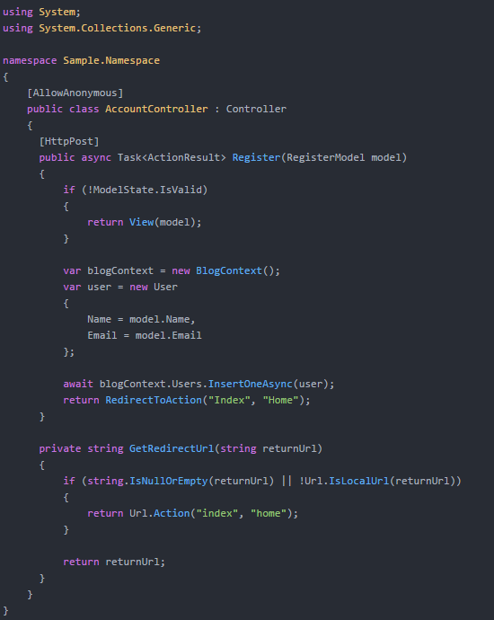

# OneDarkJekyll

*Use Atom's One Dark syntax colors in your Jekyll powered blog!*

It's LESS file which can generate a - Pygments, Rouge compatible - stylesheet from Atom editor's One Dark syntax theme (and any theme based on it, for example One Dark Vivid, Firewatch, etc.).

Download the stylesheet files or generate a new one from any Atom syntax theme which based on One Dark (the variable names in `colors.less` must match with One Dark's)

## Generate a stylesheet file

1. `npm install -g lessc less-plugin-clean-css`
2. Clone this repository
3. Download the `colors.css` file from the syntax theme's repository (for example https://github.com/atom/one-dark-syntax/blob/master/styles/colors.less in case of One-Dark)
4. Put the previously downloaded file next to `syntax.less`
5. Run `lessc syntax.less syntax.css --clean-css`
6. Use the `syntax.css`

Sample highlighted c# snippet:

It's not final and in case you find any error feel free to create a PR. :)
